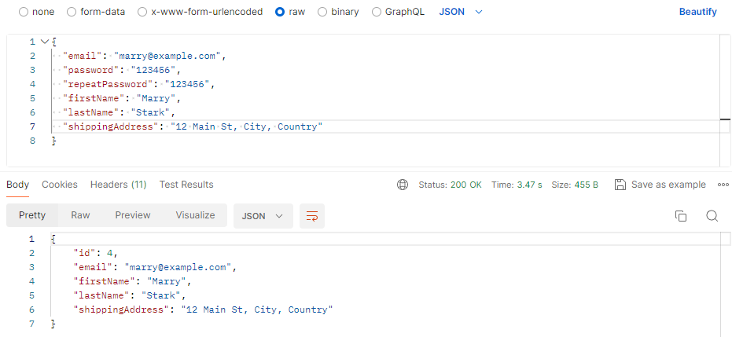
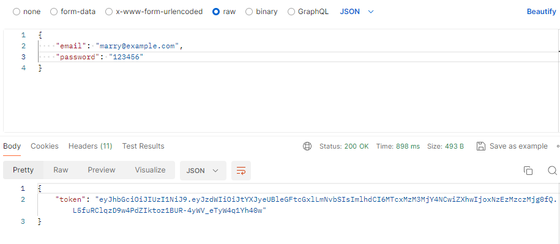

# Online book store application 📚
## Description of the project 📖

The Bookstore is a service that provides the ability to register customers, perform CRUD operations with the
book entity (`create`, `read`, `update` and `delete`) in the database, as well as user authentication.

## Technical components of the project: ⚙️🛠
* Programming Language : **_Java 17_**
* Framework: **_Spring Boot 3.1.4_**
* Database: **_MySQL 8.0.32_**
* Lombok: **_For automatic template code generation_**
* Spring Security and JWT: **_Required for security, password encryption and authentication_**
* MapStruct: **_To display models in DTO and mapper generation_**
* Liquibase: **_To manage database schema versions and migrations_**
* Docker: **_version 25.0.3_**
* Testing: **_JUnit5_**
* Testcontainers: **_To run containerized database instances for realistic integration tests_**

## Endpoints for using the API: 📍

This section will list all available endpoints by access level.

### Endpoints for unregistered or unauthenticated users:
* POST: /api/auth/registration - registration a new user
* POST: /api/auth/login - authenticate in system
### Endpoints for users with the USER role
* GET: /api/books - get a list of all books
* GET: /api/books/{id} - get a book by id
* GET: /api/categories - get a list of all categories
* GET: /api/categories/{id} - get a category by id
* GET: /api/categories/{id}/books - get a list of all books by category id
* POST: /api/orders - create new order and add shipping address
* GET: /api/orders - get a list of all orders for a specific user
* GET: /api/orders/{id}/items - get a list of all order items for a specific user's order
* GET: /api/orders/{orderId}/items/{itemId} - get order item by id for a specific user's order
* GET: /api/cart - get a shopping cart for a specific user
* POST: /api/cart - add new book to the shopping cart
* PUT: /api/cart/cart-items/{id} - update cart item
* DELETE: /api/cart/cart-items/{id} - delete cart item from the shopping cart
### Endpoints for users with the ADMIN role
* POST: /api/books - create a new book
* DELETE: /api/books/{id} - delete a book by id
* PUT: /api/books/{id} - update a book by id
* POST: /api/categories - create a new category
* PUT: /api/categories/{id} - update a category by id
* DELETE: /api/categories/{id} - delete a category by id
* PATCH: /api/orders/{id} - update order's status

## Advice on using the api

To run the API, you will need to use docker. Also, to use the post and put endpoints, you must use a JSON request body.

## Example of user registration 👨‍💻

To register a user, use the POST method:
```code
/api/auth/registration
```
An example of a request:
```json
{
  "email": "kate@example.com",
  "password": "123456",
  "repeatPassword": "123456",
  "firstName": "Kate",
  "lastName": "Johnson",
  "shippingAddress": "125 Main St, City, Country"
}
```

### **Note:**
When you create a user using the post method, he is automatically assigned the USER role. 
To change the role to ADMIN, execute a sql query after registration:
```code
INSERT INTO users_roles (user_id, role_id) values(NEW_USER_ID, 2);
```
In response, you will receive information about the registered user with the assigned ID:


## Example of user login 👨‍💻

For user login, use the POST method:
```code
/api/auth/login
```
An example of a request:
```json
{
  "email": "marry@example.com",
  "password": "123456"
}
```
In response, you will receive a unique access token that you can use for further requests:

